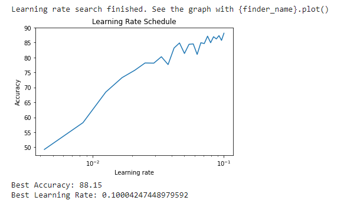
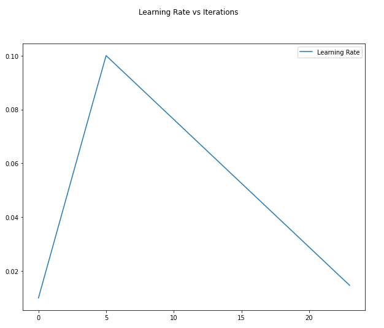

## Session 11 Assignment - Team Submission
Team Members
1. S.A.Ezhirko
2. Naga Pavan Kumar Kalepu

**CLR(Cyclic Learning Rate) Curve:**  

**Modified Version of ResNet model summary:**  

**Model Graph:**  

**LR Range Test Results Graph:**  

**One Cycle LR Graph:** 

**Our observations or Learnings from this Assignment:**

1. We should not apply too much image augumentation (higher probability of each image augmentation technique) and have to apply what its required, as we have seen model drops it's accuracy when we applied higher regulirisation. And when we reduced the probabilities for some image augmentation techniques, accuracies started increasing.

2. Higher batch sizes gives better accuracy

3. Higher LR gives balanced class wise accuracy and reduced overfitting compare to lower LR model. So higher LRs are regularising the network.

