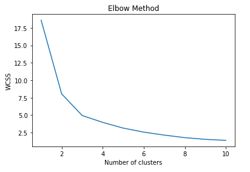
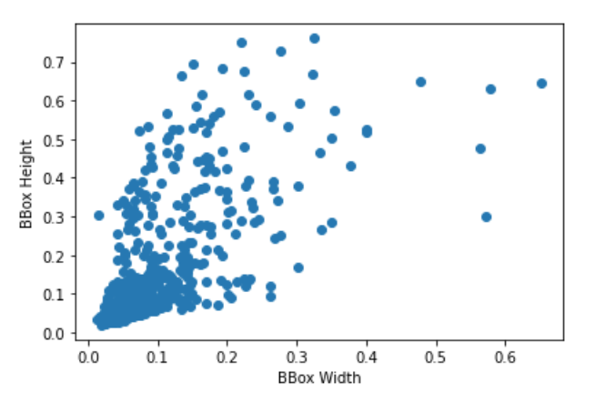
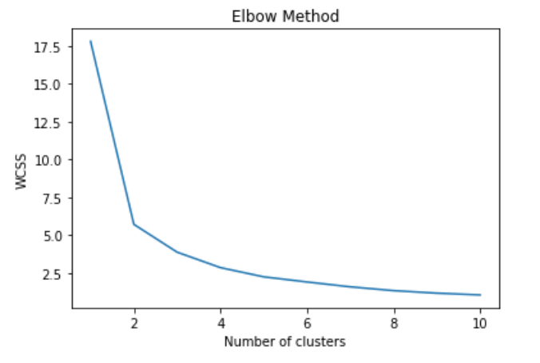

## Session 12 - Team Submission
Team Members
1. S.A.Ezhirko
2. Naga Pavan Kumar Kalepu
**********************************************************************************************************************
## **Assignment A - Tiny ImageNet**  [Code](https://github.com/eva5covergence/EVA5_AI_Projects_new/blob/master/orchestrators/Session12_Assignment.ipynb)


Used standard ResNet18 model architecture  on **Tiny ImageNetData Set**

### **Implementation**

***Added [tinyimagenet](https://github.com/eva5covergence/EVA5_AI_Projects_new/blob/master/data/tiny_imagenet.py) file for processing of tiny image net data.***

1. tiny_imagenet.py to download, mix train and test, split and convert to the dataset format.
2. Changes are done to Data loader class to handle tiny imagenet data loading.
3. Modified Resent18 method to pass 200 classes to support tiny imagenet dataset
4. Used One Cycle Policy as Scheduler. It yielded better and fast results than others
5. Reached the target accuracy

### **Parameters**

1. Agumentations - Horizontal flip, Padding , Random Crop, Center Crop, Normalisation, Cutout
2. Batch Size - 126
3. Model - Resnet 18 with 200 classes
4. Optimiser - SGD(momentum - 0.9 )
5. Scheduler - One Cycle (  max_lr=0.10004247448979592, epochs=50, pct_start=15.0/50.0, steps_per_epoch = math.ceil(77000/128.0), 
                  cycle_momentum=False, div_factor=10, final_div_factor=1, anneal_strategy="linear")

### **Results**

1. Best train Accuracy - 98.30%
2. Best test Accuracy - 57.58%
3. Accuracy Change Graph


## **Assignment B - Find out the best total numbers of clusters**

We collected 60 images and 80 images individually. And annotated bounding boxes for a) hardhat, b) vest, c) mask, d) boots using VGG tool suggested in assignment instructions.

After we annotated and downloaded the json file from it and it has collected the data in the following format.

**Bounding box information in json format:**

```
     "img_003.jpg27690": {
      "filename": "img_003.jpg",
      "size": 27690,
      "regions": [
        {
          "shape_attributes": {
            "name": "rect",
            "x": 164,
            "y": 12,
            "width": 76,
            "height": 40
          },
          "region_attributes": {
            "name": "hardhat"
          }
        },
        {
          "shape_attributes": {
            "name": "rect",
            "x": 322,
            "y": 81,
            "width": 124,
            "height": 219
          },
          "region_attributes": {
            "name": "vest"
          }
        }
      ],
    },
```
 
**Explanation of bounding box and other attributes in json file:**
 
 **filename** - Name of the image
 **size** - size of the image in bytes
 **regions** - Collection of regions (bounding boxes)
 **shape_attributes** - Attributes of the shape of the bounding box (name, x, y, width, height)
 **name inside shape_attributes** - shape of the bounding box. Here it is rectangle.
 **x,y** - Left top corner of the boudning box
 **width, height** - bounding box's width and height
 **region_attributes** - Attributes describing the about the region (name of the object class)
 **name in region_attributes** - object's class name
 
**We processed the json data and created a dataframe as below:**

Data columns (total 14 columns):
 #   Column           Non-Null Count  Dtype  
---  ------           --------------  -----  
 0   img_name         572 non-null    object 
 1   img_width        572 non-null    float64
 2   img_height       572 non-null    float64
 3   object_name      572 non-null    object 
 4   x                572 non-null    float64
 5   y                572 non-null    float64
 6   cx               572 non-null    float64
 7   cy               572 non-null    float64
 8   bb_width         572 non-null    float64
 9   bb_height        572 non-null    float64
 10  cx_s_img         572 non-null    float64
 11  cy_s_img         572 non-null    float64
 12  bb_width_s_img   572 non-null    float64
 13  bb_height_s_img  572 non-null    float64
 
 
**Explanation of the created dataframe from collected json data:**
 
**img_name** - Image file name
**img_width, img_height** - Height and Width of the image
**object_name** - object's class name
**x, y** - Left top corner of the boudning box
**cx, cy** - Centroid of the bouding box calculated using x,y (left top corner of bounding box) and bb_width, bb_height - cx = x+(bb_width/2), cy = y+(bb_height/2)
**bb_width** - Bounding box width relative to the image dimensions
**bb_height** - Bounding box height relative to the image dimensions
**cx_s_img** - Centroid of the boudning box scaled relative to image and normalized by image's width
**cy_s_img** - Centroid of the boudning box scaled relative to image and normalized by image's height
**bb_width_s_img** - Bounding box width relative to the image dimensions and normalized by image's width
**bb_height_s_img** - Bounding box height relative to the image dimensions and normalized by image's height

 **Object classes statistics from Ezhirko's images:**

```
**** Object class counts in all the images ****

 hardhat    198
boots      184
vest       182
mask       135
Name: object_name, dtype: int64
```

 **Visualisation of Ezhirko PPE data k-means clusters:**
 

 
 **Elbow method to find out K in Ezhirko PPE Dataset:**
 


**Based on above graph through elbow method 3 anchor boxes per grid cell will be good.**


**Object classes statistics from Pavan's images:**

```
**** Object class counts in all the images ****

 vest       170
boots      156
mask       130
hardhat    116
Name: object_name, dtype: int64
```

**Visualisation of Pavan PPE data k-means clusters:**
 

 
 **Elbow method to find out K in Pavan PPE Dataset:**
 


**Based on above graph through elbow method, 2 or 3 anchor boxes per grid cell will be good.**


 
 
